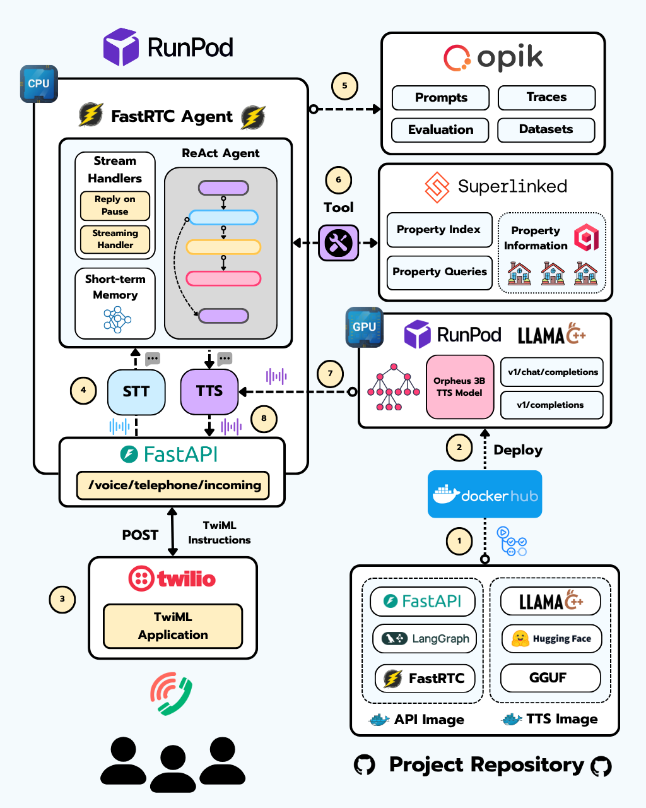

<div align="center">
  <h1>☎️ Realtime Phone Agent ☎️</h1>
  <h3>Realtime AI voice agents with FastRTC, Superlinked, Twilio, Opik and Runpod</h3>
</div>

</br>

<p align="center">
    
</p>

---

## The tech stack

<table>
  <tr>
    <th>Technology</th>
    <th>Description</th>
  </tr>
  <tr>
    <td></td>
    <td>The python library for real-time communication.
</td>
  </tr>
  <tr>
    <td></td>
    <td>SSuperlinked is a Python framework for AI Engineers building high-performance search & recommendation applications that combine structured and unstructured data.

</td>
  </tr>
  <tr>
    <td></td>
    <td>The end-to-end AI cloud that simplifies building and deploying models.</td>
  </tr>
  <tr>
    <td></td>
    <td>Debug, evaluate, and monitor your LLM applications, RAG systems, and agentic workflows with comprehensive tracing, automated evaluations, and production-ready dashboards.</td>
  </tr>
  <tr>
    <td></td>
    <td>Twilio is a cloud communications platform that enables developers to build, manage, and automate voice, text, video, and other communication services through APIs.</td>
  </tr>
</table>

## Audio Routing

The voice stack supports these providers:

- STT: `moonshine`, `whisper-groq`, `faster-whisper`
- TTS: `kokoro`, `together`, `orpheus-runpod`

The bilingual call flow can now prompt callers to choose English or Spanish at the start of the call. English callers keep the current TTS path, while Spanish callers can be routed to a dedicated Spanish Orpheus endpoint by enabling:

```env
CALL_FLOW__LANGUAGE_SELECTION_ENABLED=true
ORPHEUS_SPANISH__API_URL=YOUR_SPANISH_ORPHEUS_URL
```

For the full env setup and RunPod helper commands, see [docs/GETTINGS_STARTED.md](docs/GETTINGS_STARTED.md).

## License

This project is licensed under the Apache License - see the [LICENSE](LICENSE) file for details.
