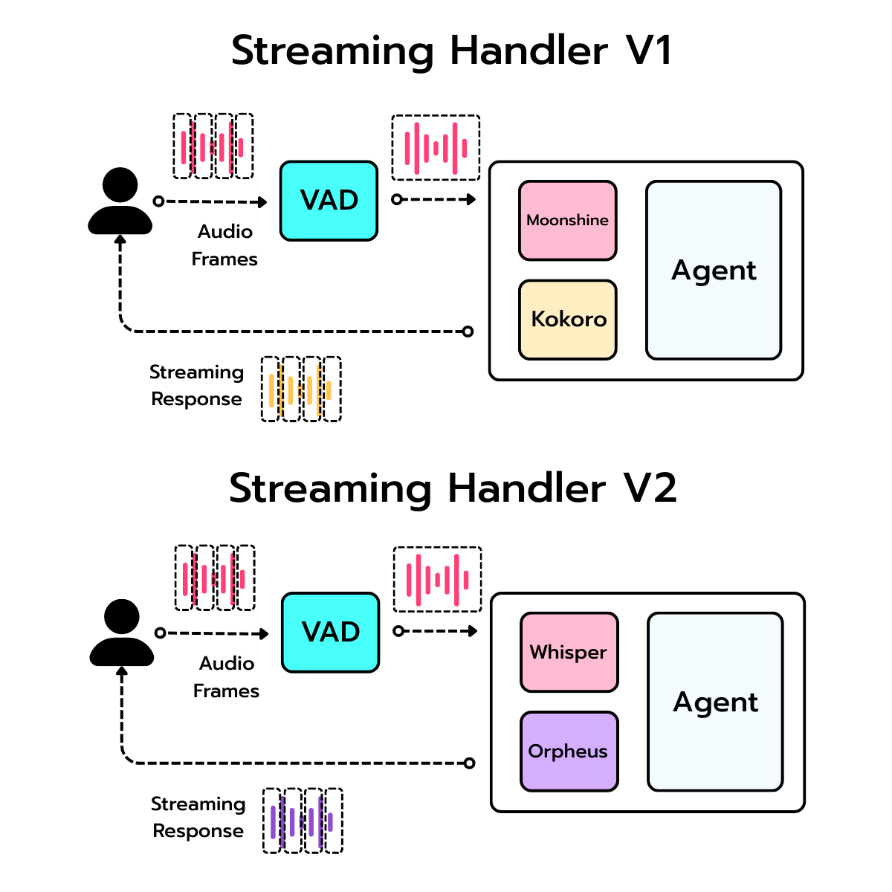

# Getting Started

## 1. Clone the repository

```bash
git clone https://github.com/neural-maze/realtime-phone-agents-course.git
cd realtime-phone-agents-course
```

## 2. Install uv

This project uses `uv` as the Python package manager.

Follow the official installation guide:
https://docs.astral.sh/uv/getting-started/installation/

## 3. Install the project dependencies

```bash
uv venv .venv
. .venv/bin/activate
uv pip install -e .
```

Sanity check:

```bash
uv run python --version
```

## 4. Create your environment file

```bash
cp .env.example .env
```

The Blue Sardine hotel agent keeps the hotel KB, prompts, and routes exactly as they are today. The new part is the modular audio stack:

<p align="center">
  
</p>

### Default audio setup

The repo now defaults to a self-hosted pair:

```env
STT_MODEL=faster-whisper
TTS_MODEL=orpheus-runpod
```

With those defaults, you must set these values before the voice stack can start:

```env
FASTER_WHISPER__API_URL=YOUR_FASTER_WHISPER_URL_GOES_HERE
ORPHEUS__API_URL=YOUR_ORPHEUS_URL_GOES_HERE
```

### Hotel knowledge and prompt setup

The hotel agent defaults to the versioned Blue Sardine bundle and a dedicated hotel knowledge collection:

```env
KNOWLEDGE_BASE__DEFAULT_BUNDLE_PATH=data/blue_sardine_kb/2026-04-11
KNOWLEDGE_BASE__COLLECTION_NAME=hotel-knowledge
KNOWLEDGE_BASE__DEFAULT_HOTEL_ID=blue_sardine_altea
```

Prompt components are loaded from Opik by name and optional pinned commit. If a prompt cannot be fetched, the app falls back to the bundled local prompt text.

```env
OPIK__API_KEY=YOUR_OPIK_KEY
OPIK__PROJECT_NAME=blue-sardine-hotel
PROMPTS__REMOTE_ENABLED=true
PROMPTS__CORE__NAME=blue_sardine.receptionist.core
PROMPTS__CORE__COMMIT=
PROMPTS__RETRIEVAL__NAME=blue_sardine.receptionist.retrieval
PROMPTS__RETRIEVAL__COMMIT=
PROMPTS__ESCALATION__NAME=blue_sardine.receptionist.escalation
PROMPTS__ESCALATION__COMMIT=
PROMPTS__STYLE__NAME=blue_sardine.receptionist.style
PROMPTS__STYLE__COMMIT=
```

To ingest the bundle manually:

```bash
uv run python scripts/ingest_hotel_kb.py
```

If you want callers to choose English or Spanish at the start of the call, also set:

```env
CALL_FLOW__LANGUAGE_SELECTION_ENABLED=true
ELEVENLABS__API_KEY=YOUR_ELEVENLABS_KEY_GOES_HERE
ELEVENLABS__VOICE_ID_ES=gJlzF5JxsCvM5hQAoRyD
```

### Supported provider values

```env
STT_MODEL=moonshine | whisper-groq | faster-whisper
TTS_MODEL=kokoro | together | orpheus-runpod
```

## 5. Required keys and provider-specific settings

### Groq

Groq is used by the hotel agent LLM, and can also be used for Whisper STT if you choose `STT_MODEL=whisper-groq`.

```env
GROQ__API_KEY=YOUR_GROQ_KEY
GROQ__BASE_URL=https://api.groq.com/openai/v1
GROQ__MODEL=openai/gpt-oss-20b
GROQ__STT_MODEL=whisper-large-v3
```

### OpenAI

OpenAI is used for the Superlinked natural query flow in the hotel knowledge layer.

```env
OPENAI__API_KEY=YOUR_OPENAI_KEY
OPENAI__MODEL=gpt-4o-mini
```

### Together AI

Use this when you want hosted Orpheus instead of the RunPod TTS path.

```env
TOGETHER__API_KEY=YOUR_TOGETHER_KEY
TOGETHER__API_URL=https://api.together.xyz/v1
TOGETHER__MODEL=canopylabs/orpheus-3b-0.1-ft
TOGETHER__VOICE=tara
TOGETHER__SAMPLE_RATE=24000
```

Then switch:

```env
TTS_MODEL=together
```

### RunPod

RunPod is used by the default self-hosted audio path.

```env
RUNPOD__API_KEY=YOUR_RUNPOD_KEY
RUNPOD__FASTER_WHISPER_GPU_TYPE=NVIDIA GeForce RTX 4090
RUNPOD__ORPHEUS_GPU_TYPE=NVIDIA GeForce RTX 5090
```

The deployed RunPod endpoints are configured here:

```env
FASTER_WHISPER__API_URL=YOUR_FASTER_WHISPER_URL
FASTER_WHISPER__MODEL=Systran/faster-whisper-large-v3

ORPHEUS__API_URL=YOUR_ORPHEUS_URL
ORPHEUS__MODEL=orpheus-3b-0.1-ft
ORPHEUS__VOICE=tara
ORPHEUS__TEMPERATURE=0.6
ORPHEUS__TOP_P=0.9
ORPHEUS__MAX_TOKENS=1200
ORPHEUS__REPETITION_PENALTY=1.1
ORPHEUS__SAMPLE_RATE=24000
ORPHEUS__DEBUG=false
```

Spanish telephone TTS now uses ElevenLabs, so no Spanish Orpheus RunPod pod is required.

### Language-selection call flow

To route English and Spanish callers to different TTS paths, enable the call flow:

```env
CALL_FLOW__LANGUAGE_SELECTION_ENABLED=true
CALL_FLOW__SELECTION_RETRY_LIMIT=2
CALL_FLOW__RINGBACK_SECONDS=2.0
CALL_FLOW__TOOL_USE_PREAMBLE_MODE=auto
CALL_FLOW__LOOKUP_SOUND_MODE=auto
CALL_FLOW__LOOKUP_LATENCY_THRESHOLD_MS=1200
```

### Local-only audio

For local experiments without RunPod:

```env
STT_MODEL=moonshine
TTS_MODEL=kokoro
```

## 6. Create RunPod pods

The repo includes both helper scripts and Dockerfiles for the week 3 audio stack.

Create a Faster Whisper pod:

```bash
make create-faster-whisper-pod
```

Create an Orpheus pod:

```bash
make create-orpheus-pod
```

Each command prints the exact env value you should copy into `.env`.

The repo also includes:

- `Dockerfile.faster_whisper`
- `Dockerfile.orpheus`

`Dockerfile.orpheus` is configured through the `LLAMA_ARG_HF_REPO` and `LLAMA_ARG_HF_FILE` env vars so the same image can serve the current English Orpheus model.

## 7. Start the local Gradio UI

Use the env-selected providers:

```bash
make start-gradio-application
```

Or open an interactive chooser for the local UI only:

```bash
make start-gradio-application-interactive
```

The interactive chooser is only for local Gradio sessions. API and Twilio always read `.env`.

## 8. Start the API

```bash
uv run python -m realtime_phone_agents.api.main
```

If the selected voice provider is misconfigured, the HTTP knowledge routes still stay available and the voice mount fails gracefully with a clear startup error.

## 9. Twilio

You can connect Twilio to the hotel agent through the existing `/voice` route. The incoming call webhook should point to the app endpoint that serves:

```text
/voice/telephone/incoming
```

## 10. Ngrok

For local Twilio testing, expose the API publicly:

```bash
make start-ngrok-tunnel
```

Then configure Twilio to use the public HTTPS URL returned by ngrok.

## 11. Lesson 3 notebook

The repo now includes a hotel-adapted notebook for the new STT/TTS stack:

```text
notebooks/lesson_3_stt_tts.ipynb
```

It demonstrates the provider architecture and uses the bundled sample audio and diagrams added with this release.
